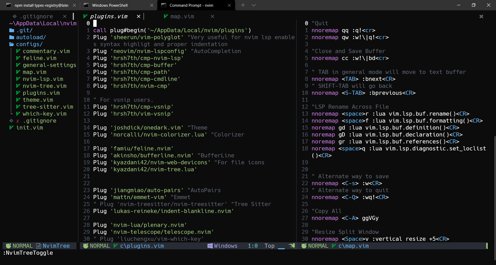

# My Neovim Config On Windows

## Prerequisite
- [Neovim](https://neovim.io)
- NerdFont [Download and Install](https://github.com/ryanoasis/nerd-fonts/tree/master/patched-fonts/Hack/Regular/complete)
- [Windows Terminal](https://www.microsoft.com/en-us/p/windows-terminal/9n0dx20hk701?activetab=pivot:overviewtab)
## Instruction
- Set Font in Windows Terminal to NerdFont
- Copy or Clone to C:\Users\\<Username>\AppData\Local\nvim
- Open Neovim
- then PlugInstall

